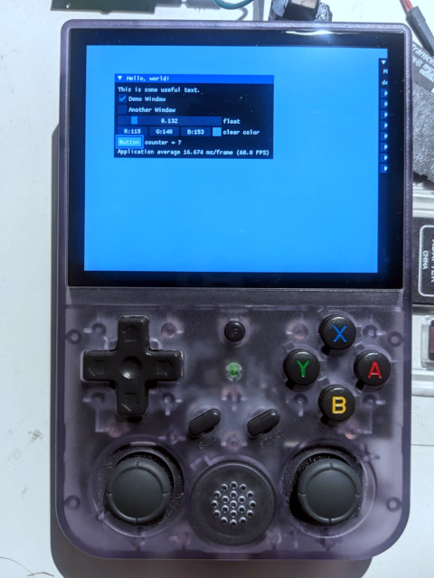

# JELOS toolchain docker images

> :rotating_light: WIP!

Docker images containing toolchain and sysroot, ready to compile programs compatible with JELOS releases for target devices.  
Some understanding of JELOS build system is needed but actually building JELOS is not.  
> :warning: Images are relatively big, assume more than 5GB is needed.

`docker pull fergusl2/jelos-toolchain:RK3566-aarch64`

## How to

Once pulled, the images can be used as build environment for your own code. Consider a `main.cpp` file containing a basic hello world program or anything that doesn't depend on anything fancy, you can use the image like the following:  
```bash
docker run --rm -ti -w /build -v $(pwd):/build \
    jelos-toolchain:RK3566-aarch64 \
    bash -c '/work/distribution/build.JELOS-RK3566.aarch64/toolchain/bin/aarch64-libreelec-linux-gnueabi-g++ main.cpp -o main-RK3566'
```

As a more involved example, the included [Makefile](./jelos.make) can be used to build an ImGui [example](https://github.com/ocornut/imgui/tree/master/examples/example_sdl2_opengl3) (SDL2 + OpenGL3). Clone imgui, copy `jelo.make` to its directory, `cd imgui` and you may then build the example using this command:
```bash
docker run --rm -ti -w /build -v $(pwd):/build \
    jelos-toolchain:RK3566-aarch64 \
    make -C examples/example_sdl2_opengl3 -f ../../jelos.make
```
  
As a bonus, touch works natively on RG353V, yay JELOS king of all custom FWs!.

## What's included

The images contain basically the entire folder found at `build.JELOS-$DEVICE.aarch64/toolchain` after building JELOS, you get the toolchain for compiling C, C++ plus the sysroot used to install the dependencies. The sysroot includes all the headers, pkg-config files and shared objects needed to link against all the libraries that JELOS builds. That means that 

## Development

Included is the Dockerfile used to build the images as well as the script, both are usually added directly to a local copy of JELOS's repo.  
Images are built with: `PROJECT=Rockchip DEVICE=RK3566 ARCH=aarch64 ./scripts/build_toolchain_docker_images`  
So far I only tested RK3566 and RK3326.
